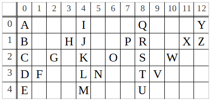

# Analysis & Design of An Algorithm – Zigzag Conversion

In this article, we develop the optimum algorithm for the [Zigzag Conversions](https://leetcode.com/problems/zigzag-conversion/) problem and analyze its complexity. We use as little technical terminology as possible in doing so. We develop the algorithm in Java. 

The problem is described in full [on Leetcode](https://leetcode.com/problems/zigzag-conversion/). Just to refresh – a zigzag of letters is constructed by lining them up in vertical blocks towards South, and in diagonal blocks towards North-East, repeatedly until all the letters in the input String are used up. The North and South corners of the zigzag are all at the same horizontal levels each, and the height of zigzag, i.e. the number of rows between its North and South ends is part of the input to this problem. 

So the input is two parts – the number of rows as an `integer` and a sequence of characters as a `String`. We’ll refer to these two parameters as _**numRows**_ and _**str**_ respectively. Both inputs are fixed for a specific problem instance, i.e. their values don’t any change throughout the solution process. In this text, we’ll use the following problem instance for example purposes:

	str = "ABCDEFGHIJKLMNOPQRSTUVWXYZ",
	numRows=5. 

The correct output for this problem is `"AIQYBHJPRXZCGKOSWDFLNTVEMU"`. 


# Problem Domain and The Algorithm

A matrix or a 2-dimensional array, or even in better terms, a checker-board is the best way to model this problem. Each letter is placed in a cell. While forming the zigzag from the given input, the next letter in sequence goes to the neighboring cell either to the South or to the North-East of the current cell. 

The zigzag corresponding to our problem instance is as follows: 



The desired output is the concatenation of row entries on the above zigzag:

	AIQY   	 // row 0
	  + BHJPRXZ	 // row 1
	  + CGKOSW 	 // row 2
	  + DFLNTV   	 // row 3
	  + EMU  	 // row 4
	= AIQYBHJPRXZCGKOSWDFLNTVEMU
	
	
As in any algorithm design, we first analyze the domain structure to put it at use for the optimum solution. In an effort to do so, first observe that the above zigzag is made up of vertical and diagonal blocks. We’ll name them as _**columns**_ and _**links**_ respectively, and the letters on them as _**column-letters**_ and _**link-letters**_. The corner letters, i.e. the letters where columns and links meet (A, I, E, ...) are column-letters by our definition. Also consider the definition of _**consecutive pairs**_ as two letters appearing on consecutive columns of a row. For example, A&I, B&J, L&T are all consecutive pairs but B&R, B&K, G&O, S&W aren’t. 

## Column-Letters

Relevant to our analysis is the _**letter-distance**_, i.e., the number of letters visited in between the two members of a given consecutive pair. This distance is fixed for a specific problem instance and is 

	2*numRows-2 = 2*(numRows-1). 

This can be thought of as travelling one full column and one full link, each of which consists of `numRows-1` letter visits, in order to get to the same row in the column next. 

**Eg:** For the following and any other consecutive pair of our problem, the letter-distance in between the pair members is `2*(5-1)=8` in total. Half of this distance is travelled on column(s) and the other half on the link in between: 

	A&I : 4 down on column and 4 diagonal on link
	K&S : 2 down on column, 4 diagonal on link and 2 down on column

>> What we define as _letter-distance_ is in fact _hop-distance_ – the number of moves from one letter to the other along the path. The number of letters between a consecutive pair is `2*(numRows-1) – 1`. However, we chose the more relevant term _letter-distance_, abusing its literal meaning.

This view breaks down the problem into the following two: 

1. For each row; calculate the consecutive pairs iteratively one after the other
1. For each consecutive pair; calculate the letter on the link in between, if there is one. 

Part (1) and Part (2) cover respectively the column-letters and link-letters. Part (1) is the step that forms the main iteration/logic of the solution algorithm. Part (2) is executed within (1) to see which link-letter, if any, in between the consecutive pair currently being worked on. So far, we’ve covered the logic that goes into (1). In the subsection below, we analyze the computation of link-letters. 


## Link-Letters 

It is fairly straightforward that, apart from the first and last rows, there is exactly one link-letter in between each consecutive pair. 
The letter-distances of link-letters from the surrounding columns vary by 2 from row to row. This is because, both the vertical and diagonal paths to travel to a link-letter from a surrounding consecutive-pair member increase (or decrease) by 1, making the total change 2. 

In another way of putting it – contradicts by our definition of link-letters, but imagine as the link-letter of A&I, the letter I itself, at 0 distance from itself and 8 from it’s pairing letter A. In the row after, the cell where H sits emerged as the one next to the column where I (now J at “this” row) is. I is neighboring both H and J in the row right above, so in order to get from H to J, one has to visit one additional cell in diagonal direction (link) and another additional cell in vertical direction (column). Similarly, the path from G to K is an extension of the path between H and J of the previous row by 1 additional cell at each end of the path. 

Putting it all together, the letter-distance between a column-letter and the link-letter right after it is:

	2*(numRows -currentRow-1)

where _currentRow_ is the index of the row being iterated on. So by this, for example, the letter-distance between D and F is 

	2*(5-3-1) = 2. 

# Computational Complexity

Following is the optimum algorithm for [Zigzag Conversions](https://leetcode.com/problems/zigzag-conversion/). This algorithm is `O(N)` where `N` is the length of the input String.


```php 
public String convert(String str, int numRows) {
   if (numRows<=1) 
      return str;
   final char[] out = new char[str.length()];
   final int max = 2 * numRows - 2;
   int leap = max, index=0;
   for (int i = 0; i < Math.min(numRows, str.length()); i++) {  // outer for-loop
      for (int j = i; j < str.length(); j += max) {  // inner for-loop
         out[index++]=str.charAt(j);  // assignment statement
		 if (leap != max && j + leap < str.length()) // if statement
		    out[index++]=str.charAt(j + leap);
	 }
	 leap -= 2;
	 if (leap < 1) 
	    leap = max;
   }
   return new String(out);
}
```

The nested for-loops in the algorithm resemble quadratic complexity at first glance. However, looking at “how many times the most repeating instruction executes”, i.e. the innermost statements in the loops, we see that they run as many times as the number of letters in the input String. This is because the outer for-loop iterates `O(numRows)` times, and the inner for-loop `O(N/numRows)`, making the overall complexity `O(N)`. The way we designed the algorithm, it is iterating to visit each letter of _str_ exactly once in the order they appear in the required output. 

> > Note here that the complexity of both innermost statements, i.e. the assignment statement and the if statement in the inner for-loop are `O(1)`. The time they take to execute don’t any depend on the input values so as to grow beyond a constant. 

The execution time of our algorithm doesn’t any depend on _numRows_, the other portion of input. The execution time grows linearly by the size of _str_ regardless of the _numRows_ value passed in.  

As for the memory complexity – all variables declared except the character array occupy `O(1)` memory. `char[] out` and the `String` created from it in the final `return` statement take `O(N)` memory space, making the memory complexity of the algorithm `O(N)`. 

Noteworthy also is that the computation time of the algorithm is in `θ(N)` when `numRows>1`. This is the case that the best/extreme cases of input are ruled out and the algorithm never returns _str_ without processing it, for any possible _str_ passed into it in the domain. Same argument applies for the memory complexity of our algorithm. 

`O(N)` is clearly the optimum complexity of both time and memory for this algorithm. The desired output is a re-arrangement of the _N_ letters input and can’t be constructed any faster than `O(N)`. Similarly, the output should be arranged into a new character sequence of length N. In an extremely restricted domain Eg.  "maximum 2 distinct letters in _str_, a repeating sequence as _str_, ...", a faster and/or in-place algorithm can be possible but that’s not the case in [Zigzag Conversions](https://leetcode.com/problems/zigzag-conversion/).  
